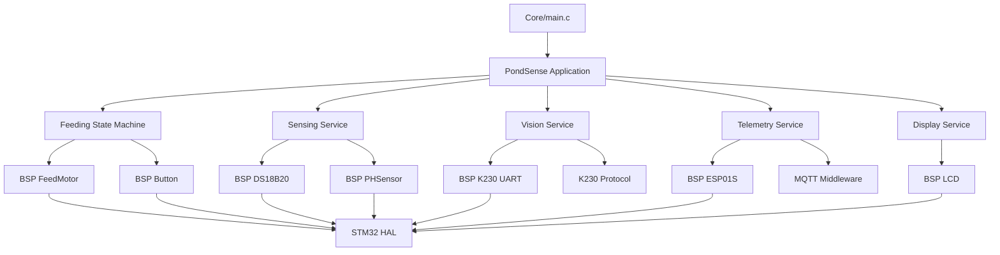
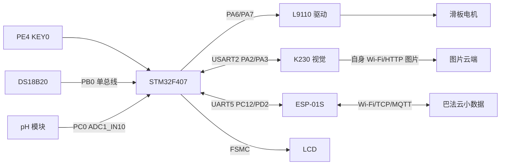

# PondSense 智能鱼类投喂器项目架构说明

## 1. 项目简介

本工程是基于 **STM32F407ZGT6** 的智能鱼类投喂器控制固件。STM32 负责投喂状态机、电机限时控制、按键解锁、DS18B20 温度采集、pH 模拟量采集、LCD 显示以及与 K230、ESP-01S 的通信。

K230 独立运行视觉推理程序。STM32 向 K230 发送带事件编号的观察请求，K230 返回 ACK 和摄食等级结果；图片由 K230 自身通过 Wi-Fi/HTTP 上传，不经过 STM32 和 ESP-01S。ESP-01S 只负责 STM32 温度、pH 和摄食等级等小数据的 MQTT 上报。

当前工程采用 STM32CubeMX 生成的 HAL 工程、Keil MDK-ARM 工程和无 RTOS 主循环。CubeMX 配置源为 `PondSense.ioc`，当前芯片为 STM32F407ZGTx，系统时钟为 168 MHz。

本文依据当前工程源码、配置和构建文件核对：

- `PondSense.ioc`
- `Core/Inc`、`Core/Src`
- `Application/PondSense`
- `BSP`
- `Middleware`
- `Services`
- `Config`
- `MDK-ARM/PondSense.uvprojx`

## 2. 软件目录

```text
PondSense/
├─ Core/                              # CubeMX 生成的入口、初始化和中断代码
│  ├─ Inc/
│  └─ Src/
├─ Drivers/                           # STM32 HAL、CMSIS 和芯片底层驱动
├─ BSP/                               # 与具体硬件或传输接口直接相关的驱动
│  ├─ Button/                         # KEY0 按键轮询和消抖
│  ├─ DS18B20/                        # 单总线温度传感器
│  ├─ ESP01S/                         # ESP-01S AT、Wi-Fi 和 TCP 状态机
│  ├─ FeedMotor/                      # L9110 电机限时驱动
│  ├─ K230/                            # K230 UART DMA 传输
│  ├─ LCD/                             # FSMC LCD 驱动和控制器初始化
│  └─ PHSensor/                        # pH ADC 原始采样
├─ Middleware/                        # 可复用协议和中间件
│  ├─ K230/                            # K230 OBS/ACK/RESULT 协议编解码
│  └─ MQTT/                            # MQTT 3.1.1 客户端和报文编解码
├─ Services/                          # 面向业务的周期服务
│  ├─ display.c/.h                    # LCD 状态显示
│  ├─ sensing.c/.h                    # 温度和 pH 采样服务
│  ├─ telemetry.c/.h                  # ESP-01S/MQTT 遥测
│  └─ vision.c/.h                     # K230 视觉事件服务
├─ Application/PondSense/             # 应用层状态机和主循环编排
│  ├─ pondsense.c/.h                  # 初始化、周期调度、回调分发和 IWDG
│  └─ feeding.c/.h                    # 初次投喂、观察和等级追加状态机
├─ Config/                            # 公开配置入口和本地敏感配置入口
├─ Tests/Host/                        # 主机端协议和状态机测试
├─ MDK-ARM/                           # Keil 工程、启动文件和构建产物
└─ PondSense.ioc                      # CubeMX 外设、引脚和时钟配置源
```

K230 端程序、模型、SD 卡内容和运行时配置不属于本 STM32 仓库。STM32 侧只保留 K230 UART 传输、协议解析和结果消费逻辑。

## 3. 分层职责

### 3.1 Core 层

Core 层由 CubeMX 管理，负责芯片启动、时钟、GPIO、DMA、UART、ADC、TIM、FSMC 和中断入口。业务逻辑不能直接堆放在 CubeMX 生成区域之外。

| 文件 | 作用 | 关系 |
| --- | --- | --- |
| `Core/Src/main.c` | HAL 初始化、系统时钟配置、CubeMX 外设初始化和主循环入口 | 初始化完成后调用 `PondSense_Init()`，循环调用 `PondSense_Process()` |
| `Core/Src/gpio.c` | 配置 KEY0、PA6/PA7 电机输出、PB0 单总线等 GPIO | 被 Button、FeedMotor、DS18B20 使用 |
| `Core/Src/usart.c` | 配置 USART2 和 UART5 及 DMA 接收 | USART2 连接 K230，UART5 连接 ESP-01S |
| `Core/Src/adc.c` | 配置 ADC1 通道 10 | PC0 连接 pH 模拟量输入 |
| `Core/Src/tim.c` | 配置 TIM2，预分频 83 | DS18B20 使用 1 MHz 级时基 |
| `Core/Src/fsmc.c` | 配置 FSMC Bank4 | LCD 并行总线访问 |
| `Core/Src/stm32f4xx_it.c` | HAL 中断入口和 SysTick 处理 | SysTick 统一执行电机限时停机；UART/DMA 中断交给 HAL |

CubeMX 工程设置 `ProjectManager.KeepUserCode=true`。修改引脚、外设、DMA、中断或时钟时，应优先修改 `PondSense.ioc` 并重新生成代码；自定义逻辑只放在 `USER CODE` 区域或独立模块中。

### 3.2 Drivers 层

`Drivers/STM32F4xx_HAL_Driver` 和 `Drivers/CMSIS` 为 STM32F4 HAL、CMSIS 和芯片寄存器访问代码。该层不包含 PondSense 业务逻辑，不应直接修改。

### 3.3 BSP 层

| 模块 | 主要职责 |
| --- | --- |
| `Button` | 读取 KEY0 GPIO，完成轮询消抖并输出一次性按下事件 |
| `DS18B20` | 产生单总线微秒时序，启动转换、读取温度和校验 CRC |
| `PHSensor` | 使用 ADC1 读取 PC0 原始值；不在 BSP 层决定 pH 校准系数 |
| `FeedMotor` | 控制 L9110 PA6/PA7 方向输出，限制单次最大运行时间；SysTick 是唯一超时停机时基 |
| `K230` | 使用 USART2 Receive-to-Idle DMA、环形缓冲和非阻塞字节读取 |
| `ESP01S` | 管理 AT 命令、热点连接、单路 TCP、接收缓存和有限重试 |
| `LCD` | 通过 FSMC 访问 LCD 控制器、绘制文字和图形 |

BSP 只处理硬件和传输机制，不决定摄食等级、投喂策略、MQTT JSON 字段或云端业务优先级。

### 3.4 Middleware 层

| 模块 | 作用 |
| --- | --- |
| `Middleware/K230` | 生成和解析 `PS1` 事件帧，执行 CRC-8/ATM 校验，检查事件编号、等级和上传状态 |
| `Middleware/MQTT` | 建立在 ESP-01S TCP 接口之上，管理 MQTT 3.1.1 CONNECT、SUBSCRIBE、PUBLISH、PING 和退避重连 |

当前 MQTT 使用 QoS 0。网络状态机采用非阻塞方式，网络失败不能阻塞本地投喂状态机。

### 3.5 Services 层

| 文件 | 作用 | 调用的下层模块 |
| --- | --- | --- |
| `sensing.c/.h` | 组织 DS18B20 异步转换、pH ADC 采样、5 点稳定判断和文本生成 | DS18B20、PHSensor、TIM2、ADC1 |
| `vision.c/.h` | 发起 K230 观察、接收 ACK/RESULT、处理事件超时和单次结果消费 | K230 BSP、K230 Middleware |
| `telemetry.c/.h` | 生成温度、pH、摄食等级 JSON 并提交 MQTT 发布 | ESP01S、MQTT、Sensing |
| `display.c/.h` | 组织 LCD 上的温度、pH、K230 和投喂状态，只刷新变化区域 | LCD、Sensing、Vision、Feeding |

Services 不直接修改 CubeMX 外设寄存器；硬件访问通过 BSP 或 HAL 句柄完成。

### 3.6 Application 层

| 文件 | 作用 |
| --- | --- |
| `pondsense.c/.h` | 初始化所有应用模块，安排每轮调用顺序，转发 UART 回调，启动并刷新 IWDG |
| `feeding.c/.h` | 管理 `WAIT_KEY0`、初次投喂、固定周期观察、追加投喂和故障锁定 |

Application 决定业务顺序：本地电机和投喂状态不依赖 MQTT；K230 返回有效等级后，等级 `0/1/2` 分别追加 `0/1/2` 个完整电机循环。

### 3.7 Config 层

| 文件 | 内容 | 原则 |
| --- | --- | --- |
| `network_config.h` | Wi-Fi/MQTT 公开入口和安全默认值 | 真实值放入被忽略的 `network_config.local.h` |
| `mqtt_secret.h` | MQTT 私钥公开入口和空值默认值 | 真实私钥只放入 `mqtt_secret.local.h` |
| `*.local.example.h` | 本地配置示例 | 不包含真实密码、主题或私钥 |

真实 Wi-Fi 密码和 MQTT 私钥不应出现在源码、架构文档、构建日志或截图中。

## 4. 总体模块关系



外部数据链路：



## 5. 启动与主循环

### 5.1 启动顺序

`main.c` 的实际启动顺序为：

```text
HAL_Init
→ SystemClock_Config（168 MHz）
→ MX_GPIO_Init
→ MX_DMA_Init
→ MX_USART2_UART_Init
→ MX_UART5_Init
→ MX_ADC1_Init
→ MX_TIM2_Init
→ MX_FSMC_Init
→ PondSense_Init
```

`PondSense_Init()` 依次准备电机、KEY0、LCD、温度/pH、ESP-01S/MQTT、K230 视觉和投喂状态机，最后启动 IWDG。

### 5.2 主循环顺序

```text
Vision_Process
→ KEY0 轮询与 Feeding_Unlock
→ 消费 K230 RESULT/UPLOAD
→ 处理视觉超时和失败
→ Sensing_Process
→ 读取最新时间戳
→ 追加投喂状态机
→ Feeding_Process
→ Display_Process
→ Telemetry_Process
→ IWDG 刷新
→ HAL_Delay(10 ms)
```

电机单次限时停止不依赖主循环，而由 `SysTick_Handler()` 每 1 ms 调用 `FeedMotor_Process()`。这样主循环处理 LCD、传感器或网络时，不会改变单次电机的限时基准。

## 6. 主要业务数据流程

### 6.1 初次投喂和固定观察周期

```text
上电/复位
→ 电机停止
→ WAIT_KEY0
→ PE4/KEY0 稳定按下
→ 初次电机循环（当前 17 秒）
→ 初次循环结束
→ 建立 60 秒绝对观察节拍
→ 发起 K230 OBS(event_id)
```

初次投喂结束后才建立首个观察截止时间。后续观察使用绝对截止时间递增，单次处理延迟不会不断累加到周期中。

### 6.2 K230 观察和等级追加

```text
F407 发送 OBS(event_id)
→ K230 返回 ACK
→ K230 运行十秒观察
→ 返回 RESULT(event_id, valid, level, upload_status)
→ F407 校验事件编号和有效性
→ level=0：不追加
→ level=1：追加 1 个完整电机循环
→ level=2：追加 2 个完整电机循环
```

当前单个电机循环时长为 17 秒，追加循环之间保留 1 秒间隔。等级只决定追加次数，不直接决定单次电机运行时长。

### 6.3 温度、pH 和 MQTT 遥测

```text
DS18B20 / pH ADC
→ Sensing_Process
→ SensingSnapshot
→ Telemetry_Process
→ MQTT JSON
→ ESP-01S UART5
→ Wi-Fi/TCP
→ 巴法云
```

图片不经过 F407 或 ESP-01S；K230 在 RESULT 返回后自行执行图片保存和 HTTP 上传。

## 7. STM32 接口与硬件边界

| 外部模块 | STM32 引脚 | 当前功能 | 备注 |
| --- | --- | --- | --- |
| K230 | PA2/PA3 | USART2 TX/RX | Receive-to-Idle DMA；115200/8N1；OBS/ACK/RESULT 协议 |
| ESP-01S | PC12/PD2 | UART5 TX/RX | Receive-to-Idle DMA；AT/TCP/MQTT |
| pH 模块 | PC0 | ADC1_IN10 | 只记录当前工程 ADC 配置；实际 PO 电气保护仍需核实 |
| DS18B20 | PB0 | GPIO 开漏单总线 | TIM2 提供微秒时基；无独立位置或温度校准结论 |
| KEY0 | PE4 | GPIO 输入 | 下拉输入；按键只负责本次上电后的首次解锁 |
| L9110/电机 | PA6/PA7 | GPIO 输出 | `FEED_IN1/FEED_IN2`；启动时一高一低，停止时两脚为低 |
| LCD | FSMC Bank4 | 16 位并行总线 | 由 LCD BSP 和控制器初始化模块使用 |

所有 UART 外设和 K230/ESP-01S 必须共地。TX/RX 按 STM32 方向交叉连接。ESP-01S 的 EN、RST、启动脚不由当前 CubeMX 工程控制，实际模块底板接法需单独确认。pH PO 输入保护、电机供电余量和滑板位置反馈不由软件架构自动保证。

## 8. DMA、中断与回调关系

| 中断源 | 当前作用 | 应用处理 |
| --- | --- | --- |
| DMA1 Stream5 / USART2 RX | K230 Receive-to-Idle DMA | `PondSense_RxEventCallback()` → `Vision_RxEventCallback()` |
| DMA1 Stream0 / UART5 RX | ESP-01S Receive-to-Idle DMA | `PondSense_RxEventCallback()` → `Telemetry_RxEventCallback()` |
| UART 错误回调 | 通知通信层恢复接收和记录错误 | `PondSense_UartErrorCallback()` 分发给 Vision/Telemetry |
| SysTick | HAL 毫秒节拍和电机限时停机 | `HAL_IncTick()` 后调用 `FeedMotor_Process()` |

中断回调只完成数据搬运、接收状态更新或快速 GPIO 停机。协议解析、JSON 生成、MQTT 状态机和投喂业务状态转换均在主循环执行。

## 9. 关键周期和容量

| 配置项 | 当前值 | 作用 |
| --- | ---: | --- |
| 初次/追加单循环电机时长 | 17000 ms | 当前一次滑板开合的限时驱动 |
| 追加循环间隔 | 1000 ms | 为机构提供释放间隔 |
| 自动观察周期 | 60000 ms | 初次投喂结束后建立的绝对观察节拍 |
| K230 结果超时 | 20000 ms | OBS/ACK/RESULT 事件超时边界 |
| DS18B20 转换时间 | 750 ms | 非阻塞转换等待 |
| 温度/pH 采样周期 | 1000 ms | 服务层采样周期 |
| pH 稳定窗口 | 5 点 | 判断当前 ADC 是否稳定 |
| LCD 刷新周期 | 100 ms | 仅在文本变化时局部刷新 |
| 主循环延时 | 10 ms | 降低空转占用；不作为电机停止时基 |
| IWDG | 约 4 秒 | 主循环健康运行保护 |

17 秒是当前阶段性机械动作时长，不等于出料克数，也不能在没有位置反馈的情况下证明滑板每次到达同一位置。

## 10. 配置与安全边界

- `PondSense.ioc` 是引脚、DMA、外设和时钟配置的上游来源。
- `Core` 生成文件只在 `USER CODE` 区域保留应用扩展。
- Wi-Fi 密码和 MQTT 私钥只写入 `Config/*.local.h`，不写入公共配置、注释、报告或日志。
- K230 的模型、图片上传账号和运行时 Wi-Fi 配置由 K230 独立部署管理。
- MQTT 下行当前只接收和消费消息，不拥有电机控制语义。
- 网络失败不能触发额外投喂，也不能阻止本地电机安全停止。

## 11. 维护原则

1. 修改引脚、DMA、UART、ADC、TIM、FSMC 或时钟时，先改 `PondSense.ioc`，再用 CubeMX 重新生成。
2. 不把业务逻辑写入 `Core/Src/main.c` 的生成区域；入口只保留 `PondSense_Init()` 和 `PondSense_Process()` 调用。
3. 电机控制只能通过 `BSP/FeedMotor` 接口进入；不要在 Application、Services 或 CubeMX GPIO 初始化中直接翻转 PA6/PA7。
4. K230 协议修改必须同步检查 `Middleware/K230`、`BSP/K230`、`Services/vision` 和外部 K230 发送端。
5. MQTT 主题、服务器和凭据修改只通过 Config 本地配置入口完成。
6. 新增阻塞操作前必须检查其对 17 秒电机限时、IWDG 刷新、DMA 接收和 60 秒观察节拍的影响。
7. 编译通过只证明代码可构建；烧录、UART 通信、电机动作、滑板位置、出料量和长期运行必须分别验收。

## 12. 当前边界和未完成项

- STM32 只接收 K230 轻量事件帧，不处理 K230 图像数据。
- K230 图片通过自身 Wi-Fi/HTTP 上传，不经过 ESP-01S。
- 电机当前采用时间限位，无滑板打开/关闭位置传感器。
- 17 秒是当前阶段性动作时长，尚未完成多轮带料重复性、出料克数和长期机械耐久验收。
- pH 仍使用临时单点基准，标准液校准和 PO 输入保护尚未完成。
- ESP-01S 主动断网、弱信号恢复、电机动作干扰和长期 MQTT 稳定性仍需专项验证。
- K230 错误帧、重复/过期帧、连续失败锁定和双方重启恢复仍需专项实板测试。
- 任何新增远程控制功能都必须先定义鉴权、超时、重复命令处理和失联安全状态。
